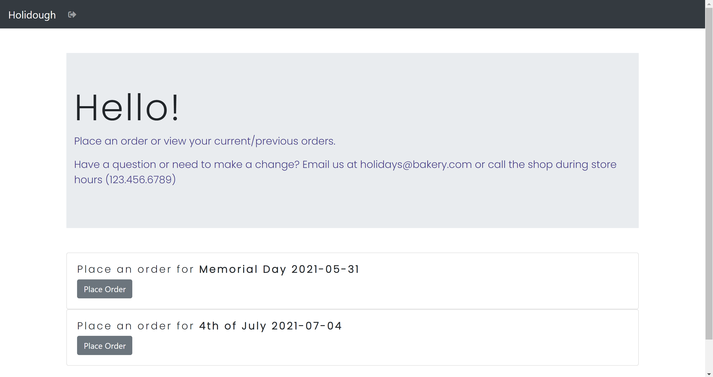

# Holidough

---

**_Holidough_** is an app developed to help bakeries collect and manage orders for special events and holidays. 

### Customers
-  Customers can register an account and login to place an order for an upcoming holiday as well as view previously placed orders from past holidays. 

### Admin
When an admin user logs in, they...
-  can view any orders placed for past or upcoming holidays.
-  can edit or cancel orders for upcoming holidays
-  can view production numbers by holiday
-  can view customer profiles
-  can view bakery items
-  can view past and upcoming holidays and the specific pick-up days, times, bakery items available for that holiday
-  can set a holiday to "available" so customers can place orders for it when they login into their accounts
-  can create and edit a new holiday and holiday order form using the bakery items

## Technology used

### Front-end

-   React
-   Firebase authentication
-   Reactstrap

### Back-end

-   .NET 5
-   ASP.NET Core
-   MS SQL Server

### Design and Development

-   Sketchboard
-   DbDiagram.io
---

## Planning Documentation

### Entity Relationship Diagram
</img>

### Wireframe
</img>
---

## Views
### Customer Views

#### Upon logging in, a customer can place an order for any available holidays that they have not previously placed an order for.

</img>

---

#### Form for a new holiday order.

</img>

---

#### Customers can view any previously placed orders.

</img>

## Try It Out

Instructions for running Holidough to see it for yourself and/or aid in further development

### Requirements

-   Git
-   Visual Studio (configured to run server-side ASP.NET Web API C# code)
-   MS SQL Server (Express or higher)
-   NodeJS

### Firebase

You will need to create a Firebase project to have working authentication and authorization.

-   Go to [Firebase](https://firebase.google.com/) and create a project (can be named anything). Add authentication in the form of email/password to the project for two users.
-   In the project settings, you will need your `Project Id` and `Web API Key`

### Clone the project

From a terminal window, in any directory you'd like, run: `git clone git@github.com:kohinrichs/Holidough.git`

### Back-end setup

-   In `Holidough/appsettings.json` change the `FirebaseProjectId` value to your Firebase `Project Id`
-   From `Holidough/SQL`, run the scripts `01_Db_Create.sql` and then `02_Seed_Data` to generate the database
-   To use the default admin account `a@a.com`, create a user account in your Firebase project's auth section with that email address (and any password) and replace the data in that user's `FirebaseUserId` column in the database with the id generated in your Firebase project. Do the same for `z@z`.com to login as and checkout the customer experience.
-   Load `Holidough.sln` in Visual Studio and hit F5 to run the server (after ensuring that Holidough is selected instead of the default IIS Express server)

### Front-end Setup

-   Create a file in `Holidough/client/` called `.env.local`
-   In this file, paste `REACT_APP_API_KEY=Web API Key`, replacing "Web API Key" with your unique key from your Firebase project's project settings
-   Run `npm install` in `Holidough/client` to install all dependencies
-   To start the development server on `localhost:3000`, run `npm start`
-   A browser window should open with the authentication page and you can enter `a@a.com` as your email address with the password you added in Firebase to see the admin view or `z@z.com` and your password to see the customer view.
